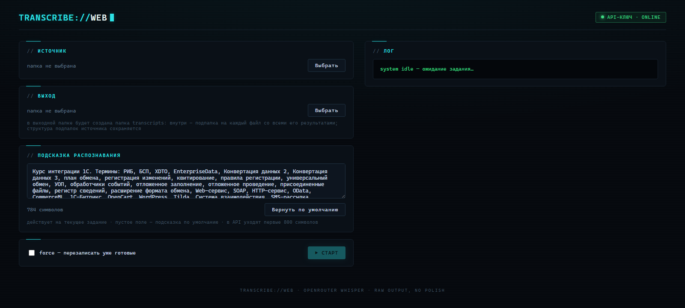

# transcribe-web

Локальный веб-инструмент пакетной транскрибации видео и аудио через облачный Whisper (OpenRouter).



Открываешь страницу на localhost → мышкой выбираешь папку с записями и папку для результатов → контейнер сам извлекает звук из видео (ffmpeg) и превращает его в текст, субтитры и JSON с таймкодами. Никакой GPU не нужен — распознавание идёт через API, оплата за минуты звука.

## Возможности

- **Любые форматы**: mp4, avi, mkv, mov, wmv, webm, flv, mpg и другие видео; mp3, wav, m4a, ogg, opus, flac и другое аудио. Звук извлекается автоматически.
- **Пакетная обработка**: выбор папки целиком (с подпапками) или отдельных файлов чекбоксами.
- **Живой прогресс**: файл, чанк, лог — через SSE. Страницу можно закрыть, задание продолжится на сервере.
- **Resume**: уже обработанные файлы пропускаются; флаг force для перезаписи.
- **Только сырой Whisper**: LLM-«полировка» сознательно не реализована — она портит доменную терминологию. Вместо неё — редактируемая подсказка распознавания (initial prompt) прямо на странице.
- **Надёжность**: длинные записи режутся на чанки по 10 минут с перехлёстом 8 секунд и сшиваются по таймкодам; ошибки API ретраятся с экспоненциальной паузой; файл без звуковой дорожки не роняет батч.
- **Отчёт**: `job-report.json` со статусами, длительностями и временем работы по каждому файлу.
- **CLI-режим** тем же образом — для скриптов и автоматизации.

## Требования

- Docker Desktop (Windows / macOS) или Docker + Compose (Linux)
- API-ключ [OpenRouter](https://openrouter.ai/keys)

## Быстрый старт

```bash
git clone <repo-url>
cd transcribe-web
cp .env.example .env        # Windows: copy .env.example .env
# открой .env: впиши OPENROUTER_API_KEY и укажи HOST_ROOT
docker compose up -d --build
```

Открой http://localhost:8080 и дальше всё мышкой:

1. **Источник** — папка с видео/аудио. Появится список найденных файлов с чекбоксами (по умолчанию выбраны все).
2. **Выход** — папка для результатов.
3. При желании поправь **подсказку распознавания** — термины, которые Whisper должен узнавать.
4. **Старт**. Прогресс, лог и статусы файлов обновляются вживую.

## Что получается на выходе

В выходной папке создаётся папка `transcripts`; в ней — подпапка на каждый файл
(структура подпапок источника сохраняется). Для файла `подпапка/лекция.avi`:

```
выход/
└── transcripts/
    ├── job-report.json         # сводка по всему заданию
    └── подпапка/
        └── лекция/
            ├── лекция.txt        # чистый текст
            ├── лекция.srt        # субтитры
            ├── лекция.json       # сегменты с таймкодами + текст + параметры
            ├── лекция.meta.json  # время работы, модель, число чанков
            └── лекция.audio.mp3  # извлечённый звук (кэш; у mp3-источников не создаётся)
```

Повторный запуск пропускает файлы, у которых txt+srt+json уже есть (resume).
Галка force перезаписывает.

## Настройки (.env)

| Переменная | По умолчанию | Что делает |
| --- | --- | --- |
| `HOST_ROOT` | `F:/` | Корень доступа: диск или папка, видимая в интерфейсе. Docker не умеет монтировать папки на лету, поэтому корень задаётся один раз — укажи достаточно широкий |
| `OPENROUTER_API_KEY` | — | Обязателен. На страницу никогда не выводится — только индикатор «найден / не найден» |
| `WHISPER_MODEL` | `openai/whisper-large-v3` | Любая whisper-совместимая модель OpenRouter (например `openai/whisper-large-v3-turbo` — быстрее и дешевле, но хуже с редкими терминами) |
| `LANGUAGE` | `ru` | Код языка Whisper (`ru`, `en`, `de`, …) или `auto` — автоопределение |
| `PROMPT_FILE` | встроенный | Свой initial prompt по умолчанию: положи файл внутрь HOST_ROOT и укажи путь вида `/host/root/...` |
| `PORT` | `8080` | Порт веб-интерфейса |

Смена значений — правка `.env` + `docker compose up -d`. Пересборка образа не нужна.

Подсказку распознавания можно также править прямо на странице перед запуском:
текст действует только на текущее задание, пустое поле возвращает подсказку по
умолчанию, в API уходят первые 800 символов.

### Другие провайдеры (не только OpenRouter)

Инструмент работает с любым OpenAI-совместимым API транскрибации — достаточно
поменять три переменных в `.env`:

| Провайдер | `OPENAI_BASE_URL` | `WHISPER_MODEL` |
| --- | --- | --- |
| OpenRouter (default) | `https://openrouter.ai/api/v1` | `openai/whisper-large-v3` |
| Groq напрямую | `https://api.groq.com/openai/v1` | `whisper-large-v3` |
| OpenAI | `https://api.openai.com/v1` | `whisper-1` |
| Локальный Whisper-сервер ([speaches](https://github.com/speaches-ai/speaches) и т.п.) | `http://host.docker.internal:8000/v1` | по настройке сервера |

Ключ кладётся в ту же переменную `OPENROUTER_API_KEY` (имя историческое — принимается
ключ любого провайдера). Требование к модели одно: поддержка
`response_format=verbose_json` с таймкодами сегментов — на них строятся srt и json.
OpenRouter-специфичные настройки роутинга (предпочтение Groq) применяются только
когда база указывает на OpenRouter.

## CLI без веб-интерфейса

```bash
docker compose run --rm transcribe-web \
  python -m app.cli --in "/host/root/путь/к/видео" --out "/host/root/путь/к/выходу" [--force]
```

Пути указываются внутри контейнера (`/host/root/...` = `HOST_ROOT` на хосте).
Ненулевой exit code, если хоть один файл упал.

## Как это работает

1. ffmpeg извлекает звук из видео → mono mp3 64 kbps (готовые mp3 идут как есть).
2. Звук режется на чанки по 600 секунд с перехлёстом 8 секунд — каждый чанк гарантированно меньше лимита загрузки API (~25 МБ).
3. Чанки уходят в OpenRouter (`audio/transcriptions`, verbose_json с сегментами) параллельно по 3, с предпочтением провайдера Groq и ретраями на 429/5xx.
4. Сегменты сшиваются по таймкодам, дубли из зоны перехлёста отбрасываются.
5. Результат пишется атомарно по файлам: txt, srt, json, meta.

## Безопасность

- API-ключ живёт только в `.env` (в `.gitignore` и `.dockerignore`), в образ не попадает, в логи не пишется.
- Контейнер видит только то, что смонтировано через `HOST_ROOT`; пишет только в выбранную выходную папку.
- Инструмент рассчитан на локальный запуск (localhost), аутентификации нет — не публикуй порт наружу.

## Ограничения

- Звук уходит в облако (OpenRouter и его провайдеры) — для конфиденциальных записей оцени применимость.
- Одно задание за раз (очередь простая по дизайну).
- Ключ и корень доступа задаются до старта контейнера, не через интерфейс.
